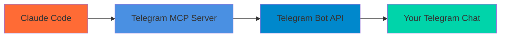

# Telegram MCP Server

[](https://www.npmjs.com/package/@tuannvm/telegram-mcp-server)
[](https://www.npmjs.com/package/@tuannvm/telegram-mcp-server)
[](https://www.npmjs.com/package/@tuannvm/telegram-mcp-server)

Send Telegram notifications from anywhere — works seamlessly across local machines, remote SSH sessions, and containerized environments.



## Quick Start

### 1. Create Telegram Bot

```bash
# Message @BotFather on Telegram
/newbot
# Follow prompts to get your bot token
```

### 2. Add to Claude Code

```bash
export TELEGRAM_BOT_TOKEN="your-bot-token"
export TELEGRAM_CHAT_ID="your-chat-id"
claude mcp add telegram -- npx -y @tuannvm/telegram-mcp-server
```

### 3. Start Using

```
Send notification "✅ DONE" to "Deployment complete"
Send telegram status to check configuration
```

## One-Click Install

[](https://vscode.dev/redirect/mcp/install?name=telegram&config=%7B%22type%22%3A%22stdio%22%2C%22command%22%3A%22npx%22%2C%22args%22%3A%5B%22-y%22%2C%22@tuannvm/telegram-mcp-server%22%5D%2C%22env%22%3A%7B%22TELEGRAM_BOT_TOKEN%22%3A%22YOUR_BOT_TOKEN%22%2C%22TELEGRAM_CHAT_ID%22%3A%22YOUR_CHAT_ID%22%7D%7D)
[](https://insiders.vscode.dev/redirect/mcp/install?name=telegram&config=%7B%22type%22%3A%22stdio%22%2C%22command%22%3A%22npx%22%2C%22args%22%3A%5B%22-y%22%2C%22@tuannvm/telegram-mcp-server%22%5D%2C%22env%22%3A%7B%22TELEGRAM_BOT_TOKEN%22%3A%22YOUR_BOT_TOKEN%22%2C%22TELEGRAM_CHAT_ID%22%3A%22YOUR_CHAT_ID%22%7D%7D)
[](https://cursor.com/en/install-mcp?name=telegram&config=eyJ0eXBlIjoic3RkaW8iLCJjb21tYW5kIjoibnB4IC15IEB0dWFubnZtL3RlbGVncmFtLW1jcC1zZXJ2ZXIiLCJlbnYiOnsiVEVMRUdSQU1fQk9UX1RPS0VOIjoiWU9VUl9CT1RfVE9LRU4iLCJURUxFR1JBTV9DSEFUX0lEIjoiWU9VUl9DSEFUX0lEIn19)

## Tools

| Tool | Description |
|------|-------------|
| `send_telegram` | Send Telegram notifications with HTML formatting |
| `telegram_status` | Check if Telegram credentials are configured |
| `send_and_wait` | Send message and optionally poll for replies with progress notifications |
| `check_replies` | Check for pending replies from Telegram (non-blocking) |

## Examples

**Simple notification:**
```
Send notification "✅ DONE" to "Build completed successfully"
```

**With context:**
```
Send notification "🚫 BLOCKED" to "Need approval to continue

📁 /path/to/project
🌿 Branch: feature/new-auth
💻 Host: production-server

Task: Deploying to production
Issue: Requires manual approval"
```

**Error reporting:**
```
Send notification "❌ ERROR" to "Deployment failed

Error: Database connection timeout
Exit code: 1
Duration: 45s"
```

**Status check:**
```
Send telegram status to verify configuration
```

**Send and wait for reply:**
```
Use send_and_wait to send "Deploy to production?" with waitForReply=true and timeout=300
```

**Check for replies:**
```
Use check_replies to see if user responded to pending messages
```

## Getting Your Chat ID

```bash
# After creating your bot, send a message to it
# Then visit this URL in your browser:
https://api.telegram.org/bot<YOUR_BOT_TOKEN>/getUpdates

# Look for "chat":{"id":123456789} in the response
```

## Requirements

- **Telegram Bot Token** — Create a bot via @BotFather on Telegram
- **Telegram Chat ID** — Your personal Telegram chat ID or group ID
- **Node.js 18+** — For local development

## Environment Variables

| Variable | Description | Required |
|----------|-------------|----------|
| `TELEGRAM_BOT_TOKEN` | Your Telegram bot token from @BotFather | Yes |
| `TELEGRAM_CHAT_ID` | Target chat ID for notifications | Yes |

## Development

```bash
npm install    # Install dependencies
npm run dev    # Development mode
npm run build  # Build for production
npm test       # Run tests
npm run lint   # Run ESLint
```

## How It Works

This MCP server runs as a separate process communicating via stdio. When you call `send_telegram`:

1. The MCP server receives the request via stdio
2. It makes an HTTP request to Telegram's Bot API
3. Your notification appears instantly on Telegram

This works reliably across:
- Local development machines
- Remote SSH sessions
- Containerized environments
- CI/CD pipelines

## Bidirectional Communication

The server supports polling-based bidirectional communication with Telegram using the getUpdates API:

1. **send_and_wait**: Send a message and poll for replies with progress notifications
2. **check_replies**: Check for pending replies from Telegram (non-blocking)

### Documentation

- **[Bidirectional Communication Guide](docs/bidirectional-communication.md)** - How to use send_and_wait and check_replies
- **[Technical Architecture](docs/architecture.md)** - Implementation details and system design
- **[Usage Examples](docs/usage-examples.md)** - Practical workflows and examples

### State Storage

The server uses file-based offset tracking for Telegram's getUpdates API:

**Location:** `~/.telegram-mcp-state/offset.json`

**Format:**
```json
{
  "offset": 123456
}
```

This stores the last processed `update_id + 1` to ensure no duplicate message processing across server restarts.

### How Polling Works

1. Server calls `getUpdates` API with the stored offset
2. Telegram returns all new messages/updates since that offset
3. Server updates the offset after processing each batch
4. For `send_and_wait`, the server polls continuously until a reply is received or timeout occurs

No external webhook is required - the server polls directly from Telegram.

## License

ISC
