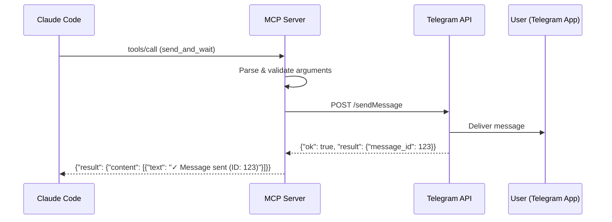
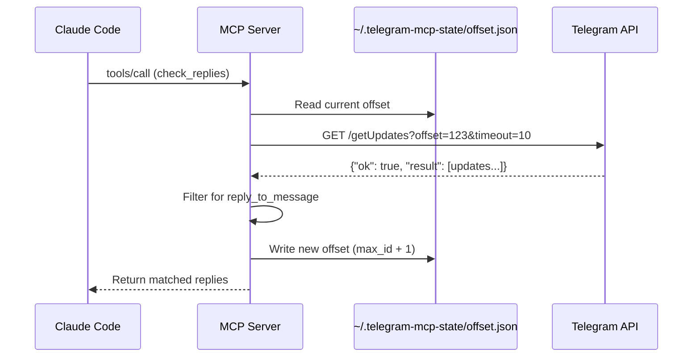
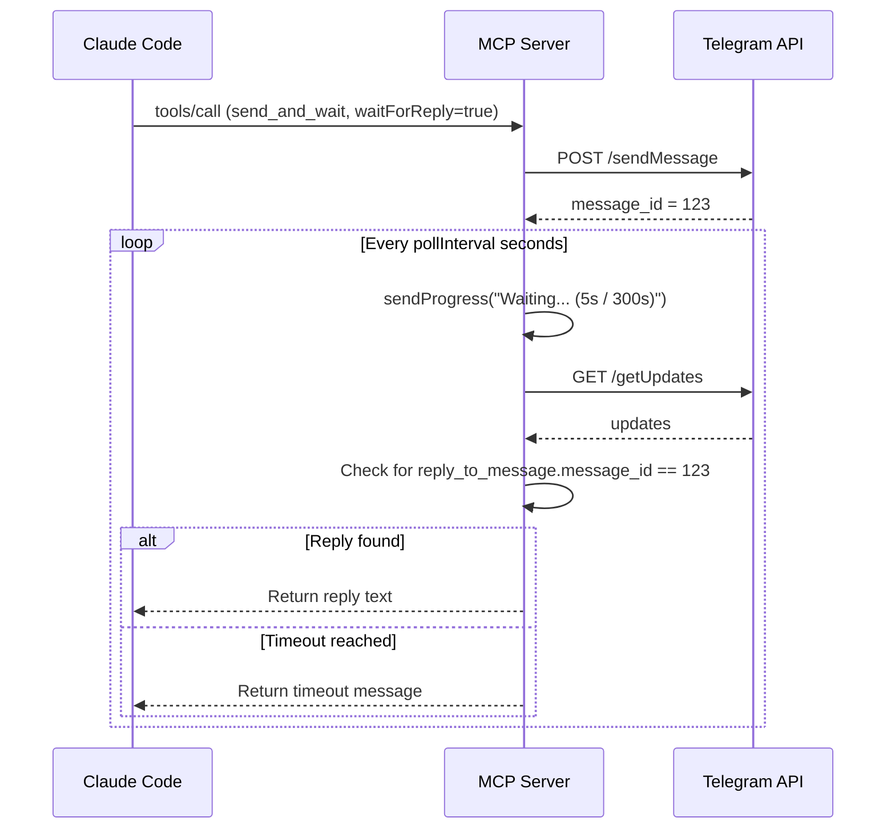

# Technical Architecture

This document describes the technical implementation of the Telegram MCP Server.

## System Architecture

```
┌─────────────────────────────────────────────────────────────────────────────┐
│                          Claude Code Environment                             │
│  ┌─────────────┐         ┌──────────────────────────────────────────────┐  │
│  │   Claude    │         │           MCP Server Process                  │  │
│  │   (Client)  │◄───────► │  ┌─────────────────────────────────────────┐ │  │
│  │             │  stdio   │  │          Server Layer                   │ │  │
│  └─────────────┘         │  │  - MCP protocol handling                │ │  │
│                          │  │  - Tool routing                         │ │  │
│                          │  └───────────────┬─────────────────────────┘ │  │
│                          │                  │                            │  │
│                          │                  ▼                            │  │
│                          │  ┌─────────────────────────────────────────┐ │  │
│                          │  │          Tools Layer                     │ │  │
│                          │  │  - handlers.ts (send_telegram, status)  │ │  │
│                          │  │  - send-and-wait.ts                     │ │  │
│                          │  │  - check-replies.ts                     │ │  │
│                          │  └───────────────┬─────────────────────────┘ │  │
│                          │                  │                            │  │
│                          │                  ▼                            │  │
│                          │  ┌─────────────────────────────────────────┐ │  │
│                          │  │       Telegram Service Layer             │ │  │
│                          │  │  - sendMessage()                       │ │  │
│                          │  │  - getUpdates() (polling)               │ │  │
│                          │  │  - waitForReply()                       │ │  │
│                          │  │  - getAllReplies()                      │ │  │
│                          │  └───────────────┬─────────────────────────┘ │  │
│                          └──────────────────┼────────────────────────────┘ │
│                                           │                                │
└───────────────────────────────────────────┼────────────────────────────────┘
                                            │
                                            ▼
                         ┌──────────────────────────────────────┐
                         │         Telegram Bot API             │
                         │  https://api.telegram.org/bot<TOKEN>│
                         │  - sendMessage                      │
                         │  - getUpdates                       │
                         └──────────────┬───────────────────────┘
                                        │
                                        ▼
                         ┌──────────────────────────────────────┐
                         │       Telegram Servers               │
                         │  - Message delivery                 │
                         │  - Update polling                   │
                         └──────────────────────────────────────┘
```

## Module Structure

### Core Components

```
src/
├── index.ts              # Entry point, server initialization
├── server.ts             # MCP server implementation
├── constants.ts          # Named constants (timeouts, intervals)
├── errors.ts             # Custom error classes
├── types.ts              # TypeScript types & Zod schemas
│
├── telegram/             # Telegram API abstraction
│   └── index.ts          # getUpdates, sendMessage, state management
│
└── tools/                # MCP tool implementations
    ├── definitions.ts    # Tool metadata & schemas
    ├── handlers.ts       # send_telegram, telegram_status
    ├── send-and-wait.ts  # send_and_wait handler
    └── check-replies.ts  # check_replies handler
```

## Data Flow

### Sending a Message



### Polling for Replies



### Waiting for Reply (Blocking)



## State Management

### Offset Tracking

The server uses Telegram's `getUpdates` API with offset tracking to prevent duplicate processing.

**Location:** `~/.telegram-mcp-state/offset.json`

```json
{
  "offset": 123457
}
```

**Offset Value:** The next `update_id` to fetch (last processed ID + 1)

**Why Offset Matters:**
- Telegram returns all updates >= the offset
- Without offset, you'd get duplicates every call
- Offset must persist across server restarts

**Update Process:**
```typescript
// 1. Read current offset
const offset = await fs.readFile(OFFSET_FILE);
const currentOffset = JSON.parse(offset).offset || 0;

// 2. Fetch updates from Telegram
const updates = await getUpdates({ offset: currentOffset });

// 3. Calculate next offset
const maxId = Math.max(...updates.map(u => u.update_id));
const nextOffset = maxId + 1;

// 4. Persist new offset
await fs.writeFile(OFFSET_FILE, JSON.stringify({ offset: nextOffset }));
```

## Protocol Details

### MCP Tool Schema

Each tool implements a JSON-RPC 2.0 compatible interface:

```json
{
  "jsonrpc": "2.0",
  "method": "tools/call",
  "params": {
    "name": "send_and_wait",
    "arguments": {
      "message": "Hello!",
      "waitForReply": true,
      "timeout": 300
    }
  },
  "id": 1
}
```

**Response Format:**
```json
{
  "jsonrpc": "2.0",
  "result": {
    "content": [
      {
        "type": "text",
        "text": "✓ Reply received: YES"
      }
    ]
  },
  "id": 1
}
```

### Progress Notifications

Long-running operations (like `waitForReply`) send progress updates:

```typescript
await context.sendProgress(
  `Waiting for reply... (${elapsed}s / ${total}s)`,
  elapsed,
  total
);
```

**Client displays:** `[=====>     ] 45% - Waiting for reply... (45s / 300s)`

## Error Handling

### Error Hierarchy

```
Error (built-in)
  ├── ToolExecutionError     (tool execution failures)
  ├── ValidationError        (input validation failures)
  ├── ConfigurationError     (missing/invalid config)
  └── NetworkError           (network/request failures)
```

### Error Response Format

```json
{
  "jsonrpc": "2.0",
  "result": {
    "content": [{
      "type": "text",
      "text": "✗ Failed: Missing TELEGRAM_BOT_TOKEN"
    }],
    "isError": true
  },
  "id": 1
}
```

## Constants Reference

| Constant | Value | Purpose |
|----------|-------|---------|
| `DEFAULT_REQUEST_TIMEOUT_MS` | 10,000 | API request timeout (10s) |
| `DEFAULT_POLL_TIMEOUT_SECONDS` | 10 | Long polling timeout |
| `MAX_POLL_TIMEOUT_SECONDS` | 10 | Telegram API max |
| `MS_PER_SECOND` | 1,000 | Time conversion |
| `DEFAULT_REPLY_TIMEOUT_SECONDS` | 300 | Default wait for reply |
| `DEFAULT_REPLY_POLL_INTERVAL_SECONDS` | 5 | Reply check interval |
| `MAX_ERROR_PREVIEW_LENGTH` | 200 | Truncate error messages |

## Type Definitions

### TelegramMessage (from API)

```typescript
interface TelegramMessage {
  message_id: number;
  from: { id: number; first_name?: string; username?: string };
  chat: { id: number; type: string };
  date: number;           // Unix timestamp
  text: string;
  reply_to_message?: {
    message_id: number;
    from: { id: number; first_name?: string };
    text: string;
  };
}
```

### TelegramUpdate (from API)

```typescript
interface TelegramUpdate {
  update_id: number;
  message?: TelegramMessage;
}
```

### SendMessageResult

```typescript
interface SendMessageResult {
  success: boolean;
  messageId?: number;
  error?: string;
}
```

## Performance Considerations

### Polling Frequency

| Interval | Pros | Cons |
|----------|------|------|
| 1-2s | Near real-time | High API usage, may hit rate limits |
| 5s (default) | Good balance, safe | Moderate delay |
| 10-30s | Low API usage | Slower response |

**Rate Limits:** Telegram allows ~30 requests/second per bot. Default polling is well within limits.

### State File I/O

The offset file is read/write on every poll. For high-frequency polling:
- File operations are async (non-blocking)
- JSON parsing is lightweight
- Consider in-memory caching for extreme use cases

### Memory Usage

- State: Single offset integer (~50 bytes)
- In-flight replies: O(n) where n = pending reply count
- No message history retained after processing

## Security Considerations

### Bot Token Storage

- ✅ Stored in environment variable (not in code)
- ✅ Never logged or exposed in error messages
- ⚠️ Visible in process listing (use secrets manager for production)

### Input Validation

- ✅ All tool inputs validated with Zod schemas
- ✅ HTML special characters escaped (XSS prevention)
- ✅ Message length limited by Telegram API

### State File Permissions

- ⚠️ Created in user home directory
- ✅ Not sensitive (only contains offset integer)
- ✅ No authentication required

## Extension Points

### Adding New Tools

1. Create tool handler in `src/tools/`
2. Add schema to `src/types.ts`
3. Register in `src/tools/handlers.ts`

```typescript
// src/tools/my-tool.ts
export class MyToolHandler {
  async execute(args: unknown, context: ToolHandlerContext): Promise<ToolResult> {
    const { input } = MyToolSchema.parse(args);
    // ... implementation
    return { content: [{ type: 'text', text: result }] };
  }
}
```

### Custom State Storage

Replace file-based storage with database:

```typescript
// Replace in src/telegram/index.ts
async function getOffset(): Promise<number> {
  // const content = await fs.readFile(OFFSET_FILE, 'utf-8');
  // return JSON.parse(content).offset || 0;
  return await db.get('telegram:offset') || 0;
}

async function setOffset(offset: number): Promise<void> {
  // await fs.writeFile(OFFSET_FILE, JSON.stringify({ offset }));
  await db.set('telegram:offset', offset);
}
```
