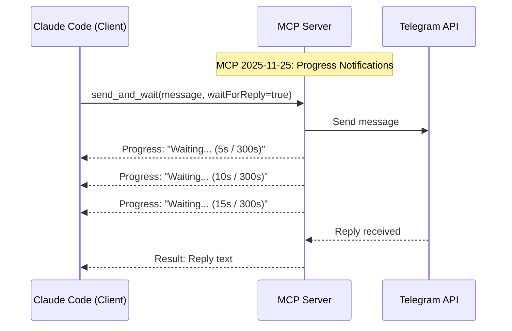

# Bidirectional Communication

This document explains how bidirectional communication works in the Telegram MCP Server.

## Overview

The Telegram MCP Server supports two-way communication with Telegram, allowing you to:

1. **Send messages** from Claude Code to Telegram
2. **Receive replies** from Telegram back to Claude Code
3. **Poll for responses** using the `check_replies` tool

## Enabled by MCP 2025-11-25 Specification

This bidirectional communication pattern is enabled by the **MCP 2025-11-25 specification** released in November 2025, which introduced experimental **Task Support** ([SEP-1686](https://modelcontextprotocol.io/specification/2025-11-25/changelog)) for tracking durable requests with polling and deferred result retrieval.

### Key Features from the 2025-11-25 Specification

| Feature | Description | Benefit |
|---------|-------------|---------|
| **Task States** | Working, input_required, completed, failed, cancelled | Clear status tracking for long-running operations |
| **Progress Notifications** | Real-time progress updates during task execution | User feedback during waits (e.g., "Waiting for reply... (45s / 300s)") |
| **Polling Support** | Active polling and result retrieval for complex workflows | Non-blocking reply checking without holding connections |
| **Deferred Results** | Call-now, fetch-later pattern | Fire-and-forget messaging with later result retrieval |

### How This Server Uses MCP 2025-11-25 Features



The `send_and_wait` tool leverages **progress notifications** to keep the client informed during long-running wait periods, while `check_replies` implements the **polling pattern** for deferred result retrieval.

**Sources:**
- [MCP 2025-11-25 Specification](https://modelcontextprotocol.io/specification/2025-11-25)
- [MCP Changelog - Key Changes](https://modelcontextprotocol.io/specification/2025-11-25/changelog)
- [One Year of MCP: November 2025 Spec Release](http://blog.modelcontextprotocol.io/posts/2025-11-25-first-mcp-anniversary/)
- [WorkOS: MCP 2025-11-25 Update](https://workos.com/blog/mcp-2025-11-25-spec-update)

## How It Works

```
┌─────────────┐                    ┌──────────────┐                    ┌─────────────┐
│  Claude     │                    │ MCP Server   │                    │  Telegram   │
│  Code       │                    │              │                    │  (Your App) │
└──────┬──────┘                    └──────┬───────┘                    └──────┬──────┘
       │                                  │                                     │
       │  1. send_and_wait(message)       │                                     │
       │ ──────────────────────────────>  │                                     │
       │                                  │  2. sendMessage API               │
       │                                  │ ─────────────────────────────────> │
       │                                  │                                     │
       │          (message sent!)         │                                     │
       │ <──────────────────────────────  │                                     │
       │                                  │                                     │
       │  3. check_replies()              │  4. getUpdates polling             │
       │ ──────────────────────────────>  │ ─────────────────────────────────> │
       │                                  │                                     │
       │  5. Reply data                   │  6. New reply detected              │
       │ <──────────────────────────────  │ <───────────────────────────────── │
       │                                  │                                     │
```

## Available Tools

### 1. send_and_wait

Send a message to Telegram and optionally wait for a reply.

**Parameters:**
| Parameter | Type | Required | Default | Description |
|-----------|------|----------|---------|-------------|
| `message` | string | Yes | - | The message text to send |
| `waitForReply` | boolean | No | false | Whether to wait for a reply |
| `timeout` | number | No | 300 | Max seconds to wait for reply |
| `pollInterval` | number | No | 5 | Seconds between reply checks |

**Returns:**
- If `waitForReply=false`: Message ID confirmation
- If `waitForReply=true`: Reply text or timeout message

### 2. check_replies

Check for pending replies from Telegram.

**Parameters:**
| Parameter | Type | Required | Default | Description |
|-----------|------|----------|---------|-------------|
| `messageId` | number | No | - | Specific message ID to check (optional) |

**Returns:**
- All pending replies if no `messageId` specified
- Specific reply if `messageId` specified

## Usage Patterns

### Pattern 1: Fire and Forget (No Reply Expected)

```typescript
// Send notification, don't wait for reply
send_and_wait({
  message: "Deployment complete!",
  waitForReply: false
})
```

### Pattern 2: Send and Wait (Blocking)

```typescript
// Send message and block until reply arrives (or timeout)
send_and_wait({
  message: "Approve deployment? Reply YES or NO",
  waitForReply: true,
  timeout: 300,
  pollInterval: 5
})
```

### Pattern 3: Send Then Poll (Non-Blocking)

```typescript
// Step 1: Send message
send_and_wait({
  message: "Should I proceed?",
  waitForReply: false  // Don't wait
})

// Step 2: Later, check for replies
check_replies()  // Returns all pending replies
```

## State Management

The server maintains state in `~/.telegram-mcp-state/offset.json`:

```json
{
  "offset": 123456
}
```

This `offset` value:
- Tracks the last processed `update_id` from Telegram
- Prevents duplicate message processing
- Persists across server restarts
- Automatically updates after each poll

## Reply Detection

A reply is detected when:
1. A message from Telegram contains `reply_to_message`
2. The `reply_to_message.message_id` matches a sent message
3. The reply hasn't been processed yet

**Example Telegram Update:**
```json
{
  "update_id": 123457,
  "message": {
    "message_id": 789,
    "from": { "id": 987654321, "first_name": "User" },
    "chat": { "id": 123456789, "type": "private" },
    "date": 1736505600,
    "text": "YES",
    "reply_to_message": {
      "message_id": 123,
      "from": { "id": 987654321, "first_name": "Your Bot" },
      "text": "Approve deployment?"
    }
  }
}
```

## Configuring Claude Code for Polling

To enable automatic reply checking, add to your `CLAUDE.md`:

```markdown
## Telegram Bidirectional Communication

When sending Telegram messages that expect replies:
1. Use `send_and_wait` with `waitForReply=false` (non-blocking)
2. Periodically call `check_replies` to check for responses
3. Present received replies to the user and continue the task

**Example:**
```
User: "Ask Telegram if deployment is approved"

Claude: [Calls send_and_wait]
       Message sent! Waiting for reply...

Claude: [Calls check_replies]
       Reply received: "YES - proceeding with deployment"
```
```

## Limitations

| Limitation | Reason | Workaround |
|------------|--------|------------|
| Server cannot push to client | MCP stdio is request/response only | Client polls with `check_replies` |
| No real-time notifications | Polling-based architecture | Use shorter `pollInterval` |
| Manual polling required | No automatic polling in Claude | Add instructions to CLAUDE.md |

## Comparison: Polling vs Webhook

| Feature | Polling (Default) | Webhook (Optional) |
|---------|-------------------|-------------------|
| Setup | No setup required | Requires public HTTPS endpoint |
| Delivery | Slight delay (polling interval) | Instant push notification |
| Resource usage | Continuous API calls | Event-driven |
| Complexity | Simple | Requires external server |
| Reliability | Works everywhere | Depends on webhook server uptime |

**Recommendation:** Start with polling (default). Only use webhooks if you need instant notifications and can maintain a webhook server.

See [webhook-example.md](webhook-example.md) for webhook setup instructions.

## Troubleshooting

**Replies not being detected:**
1. Verify the message is actually a reply (contains `reply_to_message`)
2. Check that `~/.telegram-mcp-state/offset.json` exists and is writable
3. Ensure the bot has permission to read messages in the chat
4. Try calling `check_replies` manually to see debug output

**Duplicate replies appearing:**
1. Check the offset value in `~/.telegram-mcp-state/offset.json`
2. Verify the offset is incrementing after each poll
3. The offset should always be `last_update_id + 1`

**Timeout too short/long:**
1. Adjust the `timeout` parameter in `send_and_wait`
2. Default is 300 seconds (5 minutes)
3. Maximum recommended: 3600 seconds (1 hour)
